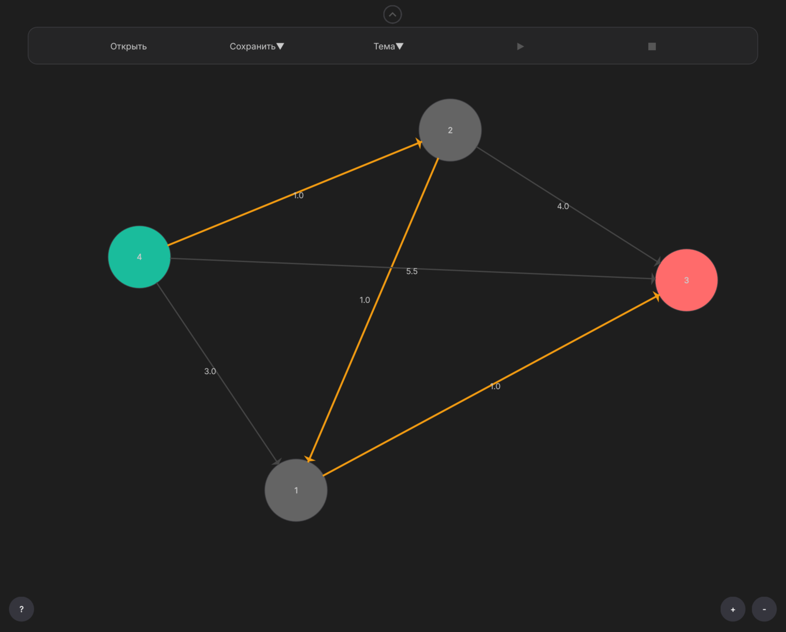

# SmoothGraphs



Простое приложение для визуализации и работы с графами.

## Описание

SmoothGraphs — это десктопное приложение, которое позволяет:
- Создавать и редактировать графы визуально
- Сохранять и загружать графы из файлов
- Находить кратчайшие пути в графе
- Экспортировать решения
- Работать с различными темами оформления

## Структура проекта

```
SmoothGraphs/
├── main.cpp                      # Точка входа в приложение
├── CMakeLists.txt                # Конфигурация сборки CMake
├── src/
│   ├── front/                    
│   │   ├── MainWindow.hpp/cpp    # Главное окно приложения
│   │   ├── GraphView.hpp/cpp     # Виджет отображения графа
│   │   ├── Figures.hpp/cpp       # Фигуры для отрисовки
│   │   ├── MenuBar.hpp/cpp       # Панель меню
│   │   ├── ThemeManager.hpp/cpp  # Управление темами
│   │   └── HelpText.hpp          # Текст справки
│   └── back/             
│       ├── Graph.hpp/cpp         # Класс управления графом
│       ├── Graphviz.hpp/cpp      # Интеграция с Graphviz
│       └── Logger.hpp/cpp        # Система логирования
└── resources/                    # Ресурсы (иконки, изображения)
```

## Требования

- CMake 3.10 или выше
- Qt6 (компоненты Core и Widgets)
- Компилятор с поддержкой C++11

## Сборка

```bash
mkdir build
cd build
cmake ..
make
```

## Запуск

После успешной сборки выполните:

```bash
./SmoothGraphs
```

## Компоненты

### Frontend
- **MainWindow** — главное окно приложения
- **GraphView** — виджет для отображения и взаимодействия с графом
- **MenuBar** — панель меню с действиями
- **ThemeManager** — управление светлой/тёмной темой
- **Figures** — графические элементы (узлы, рёбра)

### Backend
- **Graph** — основная структура данных графа, поиск путей
- **Graphviz** — экспорт графов в формат Graphviz
- **Logger** — система логирования событий
